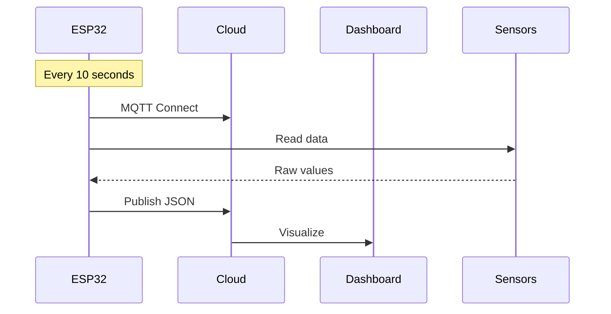

Got it! Here's a single command to generate the full `README.md` with your content (escaped properly). Just paste and run this in your terminal (PowerShell, Bash, or VS Code terminal):

> ⚠️ Make sure you're in the project directory first!

```bash
cat > README.md << 'EOF'
# 🌱 ESP32 Agricultural Monitoring System with Arduino IoT Cloud

<div align="center">
  
</div>

## 📋 Table of Contents
- [Key Features](#-key-features)
- [Hardware Requirements](#-hardware-requirements)
- [Setup Guide](#-setup-guide)
- [Cloud Configuration](#-arduino-iot-cloud-configuration)
- [Data Flow](#-data-flow)
- [Troubleshooting](#-troubleshooting)
- [Contributing](#-contributing)
- [License](#-license)

---

## 🌟 Key Features
| Feature | Description |
|---------|-------------|
| **Multi-Sensor Monitoring** | Soil moisture, NPK values, temperature & humidity |
| **Cloud Integration** | Real-time data to Arduino IoT Cloud via MQTT |
| **Smart Calibration** | Configurable dry/wet values for soil sensor |
| **Stable Connectivity** | Automatic WiFi reconnection |
| **Structured Data** | JSON-formatted payloads |

---

## 📦 Hardware Requirements
### Essential Components
- **ESP32 DevKit** (Recommended: ESP32-WROOM-32)
- **Soil Moisture Sensor** (Capacitive preferred)
- **NPK Sensor** (JXCT-IoT model)
- **DHT22** (Temperature & Humidity)
- **Power Supply** (5V/2A with battery backup)

### Wiring Guide
```
ESP32 Pin    →  Sensor
-----------------------------
GPIO34 (ADC) → Soil Moisture AO
GPIO15       → DHT22 Data
GPIO16 (RX2) → NPK Sensor TX
GPIO17 (TX2) → NPK Sensor RX
3.3V         → All Sensor VCC
GND          → All Sensor GND
```

## 🛠️ Setup Guide
### 1. Prerequisites
- Arduino IoT Cloud account
- ESP-IDF v4.4+ (or newer)
- Python 3.8+ (for optional dashboard)

### 2. Firmware Setup
```bash
git clone https://github.com/yourusername/esp32-agri-monitor.git
cd esp32-agri-monitor

# Configure WiFi credentials
sed -i 's/your_wifi/YOUR_WIFI_SSID/' main/main.c
sed -i 's/your_password/YOUR_WIFI_PASS/' main/main.c

# Build and flash
idf.py set-target esp32
idf.py build
idf.py -p /dev/ttyUSB0 flash monitor
```

### 3. Sensor Calibration
Edit `main/main.c`:
```c
// For dry soil (in air)
#define DRY_VALUE 3000  
// For fully wet soil
#define WET_VALUE 500   
```

## ☁️ Arduino IoT Cloud Configuration
Create a Thing with these variables:
```yaml
humidity: float (0-100%)
temperature: float (°C)
soilMoisture: int (0-100%)
nitrogen: int (ppm)
phosphorus: int (ppm)
potassium: int (ppm)
```

Dashboard Setup:
- Add gauge widgets for soil/NPK values
- Create time-series charts for trends

## 🔄 Data Flow


## ⚠️ Troubleshooting

| Symptom                | Solution                            |
|------------------------|-------------------------------------|
| No WiFi connection     | Verify SSID/PW, check router logs   |
| NPK sensor timeout     | Confirm baud rate (9600 default)    |
| MQTT disconnects       | Check secret key validity           |
| Inconsistent ADC reads | Add 0.1μF capacitor to sensor VCC   |

## 🤝 Contributing
We welcome contributions in:
- 🌿 New sensor integrations
- 🔋 Power optimization
- 📈 Enhanced data analytics

### Process:
1. Fork the repository
2. Create a feature branch (`git checkout -b feature/your-feature`)
3. Submit a Pull Request

## 📜 License
MIT License - See LICENSE for details.

<div align="center">
   
  
</div>
EOF
```

Let me know if you want this broken into sections or added to your GitHub directly!
